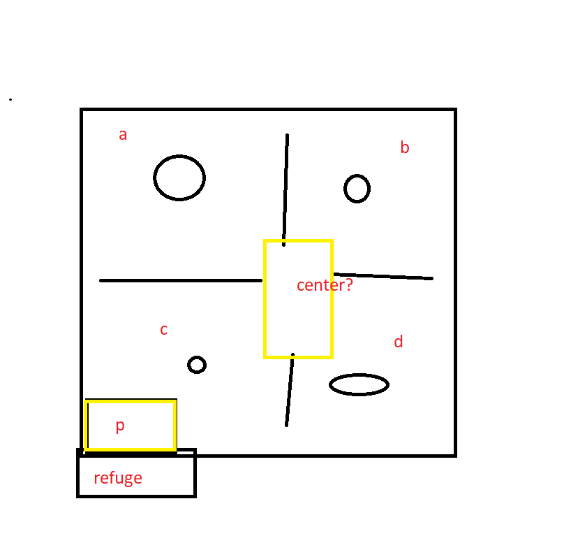
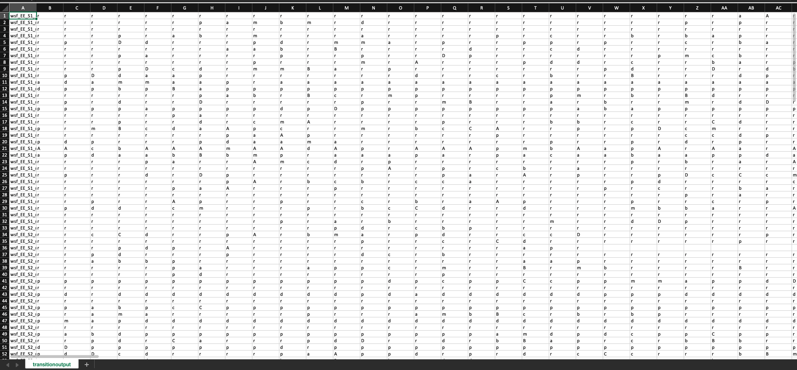
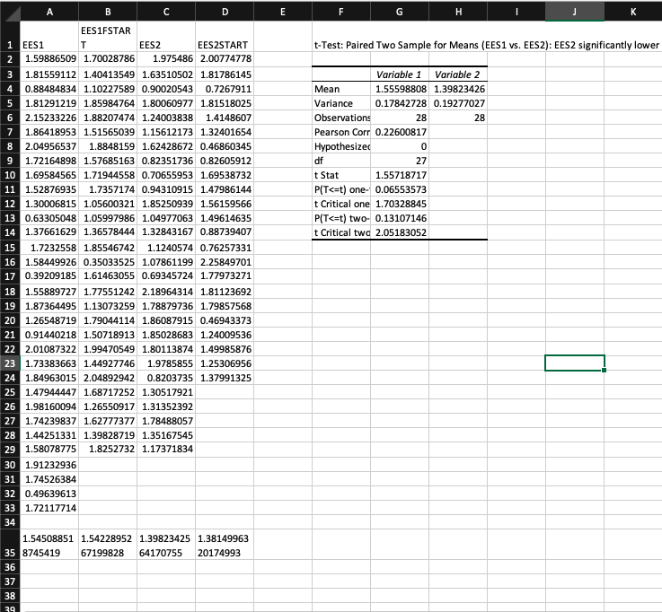
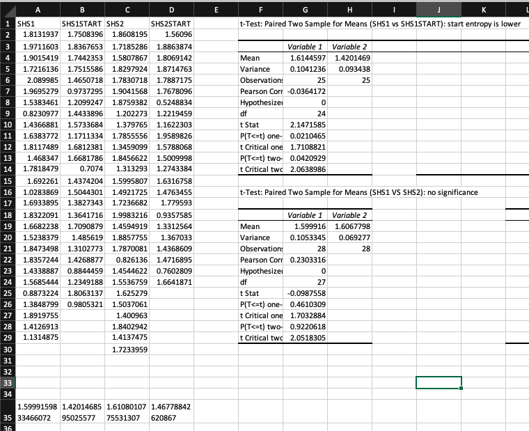
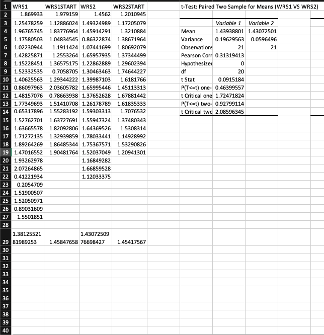

# Markov Processing for Rat Behavior Analysis 
Python code that utilizes Markov Processing to analyze rat behavior in a novel environment
## Context 
Humans often process past experience in order to take on new, complex situations. This code analyzes this ability through rats by incorporating an entropy lens 
on an [established paper's studies on experiential learning in rats](http://learnmem.cshlp.org/content/24/11/569.full). Three groups of rats were analyzed: 
- EE (Enriched Environment)
  - Received six daily 5-hour exposure to an enriched environment (40x the volume of a standard rat home cage with internal complexity through different 
  levels and objects)
- WR (Wheel Runner) 
  - Six daily 5-hour wheel running exercise
- SH (Standard Handing)
  - Standard handling twice a day 
After 6 days of the rats' respective treatments, the rats were placed in a complex open field containing four different objects in four rooms separated by
barriors. The lowercase letters represent the objects themselves while the uppercase letters represent the rooms. There was an isolated, dark refuge as well. 
The rats were left free to explore for 30 minutes, and data points tracking their locations were taken every 2.5 seconds. 

## Dataset

The first column consists of the rat identification. The general form is "wsf_EE_S1_r10T49.csv," where the group name (ex: EE), date (S1 or S2)
, and specific rat identification are listed respectivey after "wsf." The subsequent columns represent the rat's location every 2.5 seconds according to the keys 
described above under the "Context" section. 
## Procedures
The data was analyzed using Markov Processing. This process assumes that the future is independent of the past and reliant on the present and utilizes a transition
probability matrix to evaluate the entropy value for a given rat (where a higher entropy indicates greater disorder). The entropy value for a given rat's total 
time in the open field as well as the first five minutes. 
## Data
![])Images/AfterData.png)
The code outputs the data groups side by side on a single Excel sheet. For each of the three groups (EE, WR, SH), the data outputs the data for each day 
followed by the data for the first five minutes for each respective day. Each row value for the respective columns indicates the entropy value for the particular rat. 
The data was analyzed for each group utilizing T-Tests. 

A significant decrease in entropy was observed in the second day, indic

