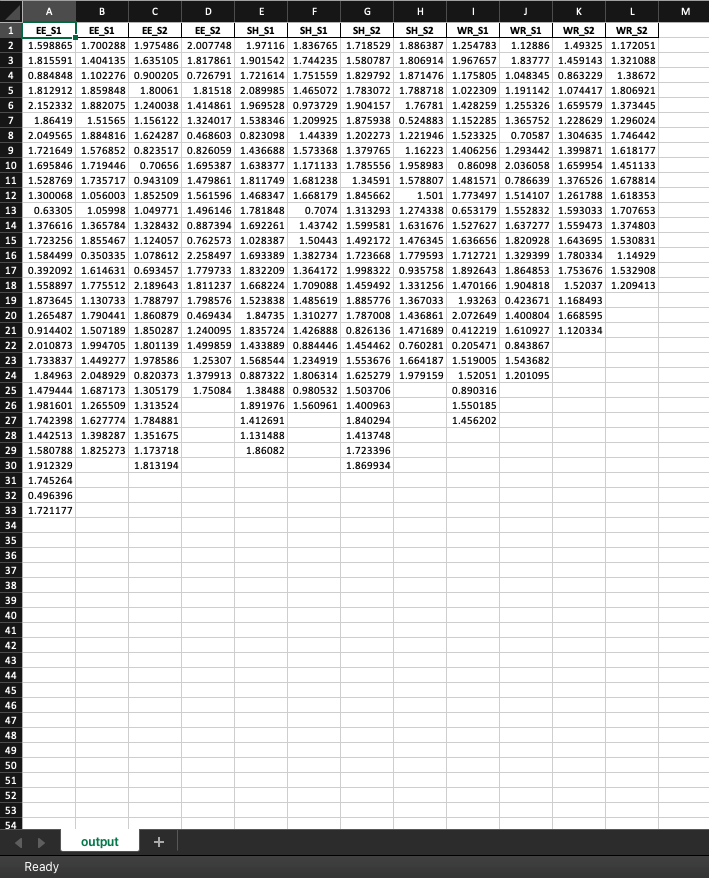

# Markov Processing for Rat Behavior Analysis 
Python code that utilizes Markov Processing to analyze rat behavior in a novel environment
## Context 
Humans often process past experience in order to take on new, complex situations. This code analyzes this ability through rats by incorporating an entropy lens 
on an [established paper's studies on experiential learning in rats](http://learnmem.cshlp.org/content/24/11/569.full).  Three groups of rats were analyzed: 
- EE (Enriched Environment)
  - Received six daily 5-hour exposure to an enriched environment (40x the volume of a standard rat home cage with internal complexity through different 
  levels and objects)
- WR (Wheel Runner) 
  - Six daily 5-hour wheel running exercise
- SH (Standard Handing)
  - Standard handling twice a day 
The referenced paper found that rats that were placed in complex learning environments (EE rats) developed superior, non-repetitive exploration strategies; these rats were demonstrated encoding concentrated in hippocampal fielld CA1 compared to rats from other groups.

After 6 days of the rats' respective treatments, the rats were placed in a complex open field containing four different objects in four rooms separated by
barriors. The lowercase letters represent the objects themselves while the uppercase letters represent the rooms. There was an isolated, dark refuge as well. 
The rats were left free to explore for 30 minutes, and data points tracking their locations were recorded every 2.5 seconds. The paper anayzed overlap in the areas explored by each group to compare learning strategies and found the greatest habituation in EE rats, followed by slight habituation demonstrated in WR rats, and no significant change in the SH rats. 
## Dataset

The first column consists of the rat identification. The general form is "wsf_EE_S1_r10T49.csv," where the group name (ex: EE), date (S1 or S2)
, and specific rat identification are listed respectivey after "wsf." The subsequent columns represent the rat's location every 2.5 seconds according to the keys 
described above under the "Context" section. 

A dataset that recorded every new location explored by the rat as opposed to data recording every 2.5 secons was also analyzed. 
## Procedures
The data was analyzed using Markov Processing. This process assumes that the future is independent of the past and reliant on the present and utilizes a transition
probability matrix to evaluate the entropy value for a given rat (where a higher entropy indicates greater disorder). The entropy value for a given rat's total 
time in the open field as well as the first five minutes. 
## Data

The code outputs the data groups side by side on a single Excel sheet. For each of the three groups (EE, WR, SH), the data outputs the data for each day 
followed by the data for the first five minutes for each respective day. Each row value for the respective columns indicates the entropy value for the particular rat. 
The data was analyzed for each group utilizing T-Tests for Two Samples Assuming Unequal Variances. T-Tests were ran to evaluate significant changes in the entropy values between
the first day of exploration and the second day of exploration for each group, and a p value of 0.05 was used to draw significance. 

A significant decrease in entropy was observed in the second day, supporting that the EE rats may have had superior, non-repetitive exploration strategies as supported in the referenced paper. 

No significant change was observed in the entropy values for the SH group, which is on par with the findings in the referenced paper. 

No significant change was observed in the entropy values for the SH group, which is slightly different to the findings in the referenced paper (should have demonstrated moderate habituation -- a slight decrease in entropy value). 

However, the averages listed at the bottom of each column (bolded) for the nontemporal data highlight that most of the significant changes observed in the temporal data were not consistent. There was only a significant increase in the entropy of the wheel runner rats, which also leans in the opposite direction of the paper (second day entropy should be slighty lower). 

Though Markov analysis of the temporal data yielded similar results to those of the referenced paper, indicating potential Markov Analysis
potential in rat behavior analysis, analysis of the nontemporal data negated these results. A nontemporal dataset sheds a more pure, unfiltered progression of rat behavior as it records every moment and is thus postulated to hold a higher degree of accuracy than a temporal dataset when analyzing entropy. Thus, it is possible that Markov Processing may not be the most accurate or consistent tool when evaluating entropy. 
